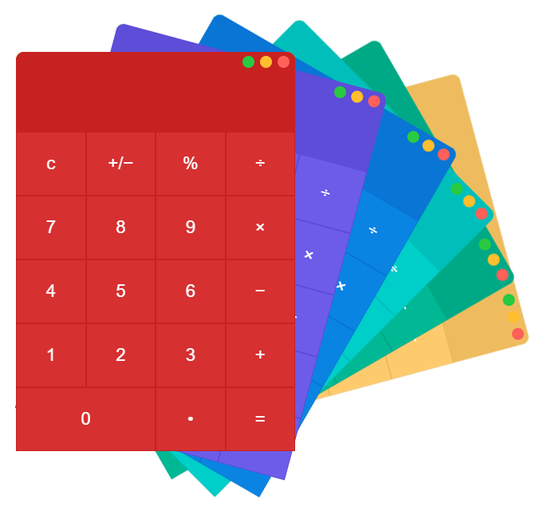

# Calculator

A simple calculator application build with Electron and React.



```sh
$ git clone https://github.com/normanndesigns/Calculator.git
$ npm install
Run both of these commands simultaneously!
$ npm start
$ npm run electron-start
```

